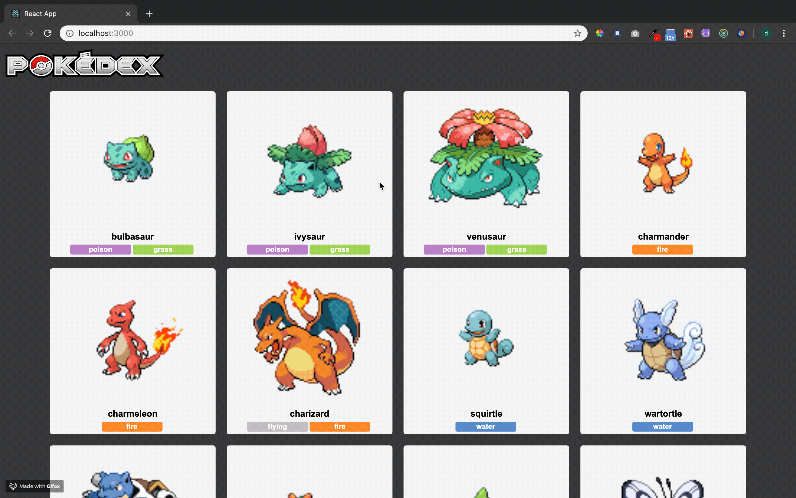

# Pokedex

## Overview:

Pokedex was a solo project to show our knowledge in react-router and redux, This app currently uses the PokeApi to fetches its information and display inforamtion about the first generation of pokemon.

[More information about original assignment can be found here](http://frontend.turing.io/projects/binary-challenge.html)

## Preview:



## Getting Started:

These instructions will get a copy of the project up and running on your local machine for usage and testing purposes.

### Frontend
clone down the repo: ```$ git clone https://github.com/MRKrog/TrapperKeeper```

cd into directory and run npm install: ```$ npm install```

launch in your browser: ```$ npm start ```

## Future Development and Extensions Notes:

- Fully keyboard navigation on note (ie. ability to press `Enter` to get to next line) \
- Add drag and drop functionality for notes \
- Add ability to search notes \
- Add ability to upload files or pictures to notes

### Technologies Used
TrapperKeeper was built using: 
- [SCSS](https://sass-lang.com/)
- [React.js](https://reactjs.org/)
- [React-Router](https://reacttraining.com/react-router/)
- [Redux.js](https://redux.js.org/)

And tested using:
- [Enzyme](https://airbnb.io/enzyme/) & [Jest](https://airbnb.io/enzyme/docs/guides/jest.html)

## Credits
Credit for this project goes to: 
- [David Cisneros](https://github.com/DevelopingDavid)

---
This project was assigned by David Whitaker and Christie Lynam 

*@ Turing School of Software and Design, Denver, CO.*

---
**[Back to top](https://github.com/DevelopingDavid/pokedex)**
